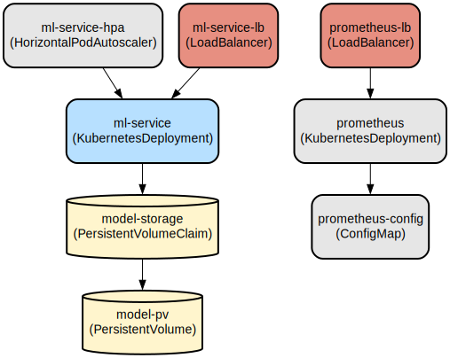

# ML Model Serving API: Scalable Sentiment Analysis Service with Kubernetes

This project provides a production-ready machine learning service that serves sentiment analysis predictions through a RESTful API. The service is containerized, horizontally scalable, and includes comprehensive monitoring capabilities through Prometheus integration.

The service is built using FastAPI and scikit-learn, providing high-performance sentiment analysis predictions with automatic scaling capabilities. It features persistent model storage, configurable deployment options, and prometheus metrics for monitoring. The architecture supports horizontal scaling through Kubernetes with automatic pod scaling based on CPU utilization, making it suitable for production workloads with varying traffic patterns.

## Repository Structure
```
.
├── Dockerfile                    # Container definition for the ML service
├── k8s/                         # Kubernetes manifests for deployment and configuration
│   ├── configmap.yaml           # Environment configuration for the ML service
│   ├── deployment.yaml          # Main service deployment configuration
│   ├── hpa.yaml                 # Horizontal Pod Autoscaler settings
│   ├── persistence.yaml         # PV and PVC definitions for model storage
│   ├── prometheus.yaml          # Prometheus monitoring setup
│   └── service.yaml             # Service exposure and load balancing
├── requirements.txt             # Python dependencies
├── src/
│   ├── api/
│   │   └── main.py             # FastAPI application entry point
│   └── model/
│       ├── train_script.py     # Model training script
│       └── trainer.py          # Model training and management class
└── tests/                      # Test files for service components
```

## Usage Instructions
### Prerequisites
- Python 3.8 or higher
- Docker
- Kubernetes cluster (for production deployment)
- kubectl configured with cluster access

### Installation
1. Clone the repository:
```bash
git clone <repository-url>
cd <repository-name>
```

2. Install Python dependencies:
```bash
pip install -r requirements.txt
```

3. Build the Docker image:
```bash
docker build -t ml-service:latest .
```

### Quick Start
1. Train the model:
```python
from src.model.trainer import ModelTrainer

trainer = ModelTrainer()
trainer.train(X_train, y_train)
trainer.save_model()
```

2. Start the service locally:
```bash
uvicorn src.api.main:app --host 0.0.0.0 --port 8000
```

3. Make a prediction:
```bash
curl -X POST "http://localhost:8000/predict" \
     -H "Content-Type: application/json" \
     -d '{"text": "This is a great product!"}'
```

### More Detailed Examples
1. Deploy to Kubernetes:
```bash
# Apply Kubernetes configurations
kubectl apply -f k8s/

# Verify deployment
kubectl get pods
kubectl get services
```

2. Monitor the service:
```bash
# Access Prometheus metrics
curl http://localhost:8000/metrics

# Check service health
curl http://localhost:8000/health
```

### Troubleshooting
1. Model Loading Issues
- Problem: Model not found error
- Solution: Verify model path in ConfigMap matches the saved model location
```bash
kubectl describe configmap ml-service-config
kubectl exec -it <pod-name> -- ls /models
```

2. Service Scaling Issues
- Problem: HPA not scaling pods
- Solution: Check CPU metrics and HPA configuration
```bash
kubectl describe hpa ml-service-hpa
kubectl top pods
```

## Data Flow
The service processes text input through a trained sentiment analysis model to produce sentiment predictions. The model uses TF-IDF vectorization followed by logistic regression classification.

```ascii
Input Text → FastAPI Endpoint → TF-IDF Vectorization → Logistic Regression → Prediction
     ↑                                                                           |
     |                                                                          |
     └─────────────── Prometheus Metrics ←─────────────────────────────────────┘
```

Key component interactions:
1. FastAPI handles HTTP requests and input validation
2. ModelTrainer manages model loading and prediction
3. Prometheus collects prediction metrics
4. Kubernetes manages scaling and deployment
5. Persistent storage maintains model availability across pods
6. Load balancer distributes incoming traffic
7. HPA adjusts pod count based on CPU utilization

## Infrastructure


### Compute Resources
- **Deployment**: ml-service
  - Replicas: 3-10 (auto-scaled)
  - Container: Python 3.8-slim based image
  - Resources: CPU and memory limits defined

### Storage
- **PersistentVolume**: model-pv
  - Size: 1GB
  - Access Mode: ReadWriteOnce
  - Path: /mnt/data

### Monitoring
- **Prometheus**
  - Deployment: prometheus
  - ConfigMap: prometheus-config
  - Service: LoadBalancer type
  - Metrics: 15s scrape interval

### Networking
- **Service**: ml-service
  - Type: LoadBalancer
  - Port: 8000
  - Protocol: TCP

## Deployment
1. Prerequisites:
- Kubernetes cluster
- kubectl access
- Docker registry access

2. Deployment steps:
```bash
# Apply storage configuration
kubectl apply -f k8s/persistence.yaml

# Apply configuration
kubectl apply -f k8s/configmap.yaml

# Deploy application
kubectl apply -f k8s/deployment.yaml
kubectl apply -f k8s/service.yaml

# Configure autoscaling
kubectl apply -f k8s/hpa.yaml

# Setup monitoring
kubectl apply -f k8s/prometheus.yaml
```